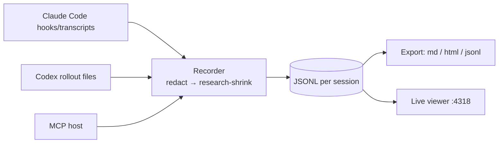

<div align="center">

# 🛩️ agent-session-recorder

**The code is the result. The session is the artifact.**

[](https://www.npmjs.com/package/agent-session-recorder)
[](https://www.npmjs.com/package/agent-session-recorder)
[](LICENSE)

A local-first flight recorder for AI coding agents. Every prompt, tool call, and decision, on one redacted timeline.

[](https://github.com/ao3575911/agent-session-recorder/actions/workflows/ci.yml)
[](LICENSE)
[](package.json)
[](CONTRIBUTING.md)

</div>

- **What:** it records Claude Code, Codex CLI, and any MCP host into one normalized JSONL timeline. You can export it as Markdown or HTML, or watch it live.
- **Why:** a diff shows you what changed. The session shows you how the agent got there: the prompts, the tool calls, the dead ends. That part is usually lost.
- **How:** everything stays on your machine. Secrets are redacted before anything touches disk. Reasoning is stored only when the provider exposes it, and it's labelled honestly.

> **Status: v0.2.** The adapters are built against documented formats and tested on synthetic fixtures. Real-world transcripts are wanted ([#10](https://github.com/ao3575911/agent-session-recorder/issues/10)).

## ⚡ 30-second quickstart

```bash
npm install --global agent-session-recorder
agent-session-recorder init           # dry-run: detects claude/codex, prints the config it would add
agent-session-recorder init --write   # Claude hooks (+ .bak) and Codex MCP config
agent-session-recorder view           # live timeline at http://127.0.0.1:4318
```

No agent handy? Open [`examples/claude-fixture-1.html`](examples/claude-fixture-1.html) to see a recorded session.

More commands: `import-claude <file>`, `codex import|tail [--latest]`, `mcp`, `export <id> --format md,html,jsonl`, `list`, `redact`. Flags: `--research` (shrinks large or repeated tool output), `--no-redact` (you probably don't want this one).

## 🎥 What gets captured

| Source | Prompts & replies | Reasoning | Tool calls / results | Timing | Tokens / model |
|---|---|---|---|---|---|
| **Claude Code** (hooks + transcript) | ✅ | `summary` (4+), `full` (3.7), `none` (redacted) | ✅ Pre/PostToolUse | ✅ measured | ✅ |
| **Codex CLI** (rollout import + live tail) | ✅ | `summary`; `none` if encrypted-only | ✅ exit code → error | ✅ | ✅ |
| **MCP** (any host) | only what the agent logs | only what the agent sends | only what the agent sends | ✅ event ts | if sent |
| Direct APIs (OpenAI / Anthropic / xAI) | 🔜 [#1](https://github.com/ao3575911/agent-session-recorder/issues/1) | 🔜 [#3](https://github.com/ao3575911/agent-session-recorder/issues/3) | | | |

The MCP server (`start_session`, `log_event`, `end_session`, `export`) only knows what the host tells it. [`SKILL.md`](SKILL.md) asks agents to report their plan, decisions, and outcome. Schema details are in [docs/event-schema.md](docs/event-schema.md).

## 🔒 Privacy

- **Local only.** Data is written to `~/.agent-session-recorder/` with `0600` file permissions. No network calls, no telemetry, no cloud.
- **Redaction always runs before a write.** Keys, tokens, emails, phone numbers, IPs, Luhn-valid cards, and home-dir usernames become placeholders like `[API_KEY_1]`. Only a salted hash → placeholder map is kept.
- **It's regex, so it's best-effort.** Review exports before you share them. Found a leak? That's a [security issue](SECURITY.md). More in [docs/redaction.md](docs/redaction.md).

## 🔏 Sealed sessions

Events are hash-chained as they are written. `seal <id> --timestamp` adds a Merkle batch with an RFC 3161 timestamp, and `verify <id>` reports OK or the exact tampered lines. See [docs/sealed-sessions.md](docs/sealed-sessions.md).

To ship a proof-carrying PR, run `bundle <sessionId> --intent <YYYYMMDD-slug> [--timestamp | --tsa url]`. It records a sealed `proof.link` event tying that intent to the current `git HEAD`, refuses to write a bundle if `verify` fails, and writes `.proof/<intent>.json` by default. Reviewers can then run the independent `proof-check` flow against that JSON bundle instead of trusting the local CLI output alone.

## 🧭 Architecture



More detail in [docs/architecture.md](docs/architecture.md) and [docs/adapters.md](docs/adapters.md).

## 🛠️ Contribute in 10 minutes

1. Pick a [`good first issue`](https://github.com/ao3575911/agent-session-recorder/labels/good%20first%20issue). Each one points to the files you'll need.
2. `npm ci && npm run build && npm test`: green in well under a minute.
3. Read [CONTRIBUTING.md](CONTRIBUTING.md) (it's short). Using an AI agent? Point it at [AGENTS.md](AGENTS.md).

Have questions or ideas? Head to [Discussions](https://github.com/ao3575911/agent-session-recorder/discussions).

## 🗺️ Roadmap

[API proxy #1](https://github.com/ao3575911/agent-session-recorder/issues/1) · [Grok CLI adapter #2](https://github.com/ao3575911/agent-session-recorder/issues/2) · [xAI reasoning #3](https://github.com/ao3575911/agent-session-recorder/issues/3) · [NER redaction #4](https://github.com/ao3575911/agent-session-recorder/issues/4) · [Session diff #5](https://github.com/ao3575911/agent-session-recorder/issues/5) · [Cost charts #6](https://github.com/ao3575911/agent-session-recorder/issues/6) · [Dataset export #7](https://github.com/ao3575911/agent-session-recorder/issues/7) · [OTel #8](https://github.com/ao3575911/agent-session-recorder/issues/8) · [Cloud sync #9](https://github.com/ao3575911/agent-session-recorder/issues/9) · [Real-session validation #10](https://github.com/ao3575911/agent-session-recorder/issues/10)

## 📚 The series behind it

1. [Part 1](https://gist.github.com/ao3575911/5a6a8c69cd48d896add442a33a9709fe) · 2. [Part 2](https://gist.github.com/ao3575911/eb6866acd9d6e015ba883e406fdc9a6b) · 3. [Part 3](https://gist.github.com/ao3575911/fd97f0e7077faeb2526b38510ee8c2cb)

## License

[MIT](LICENSE). Record freely.
